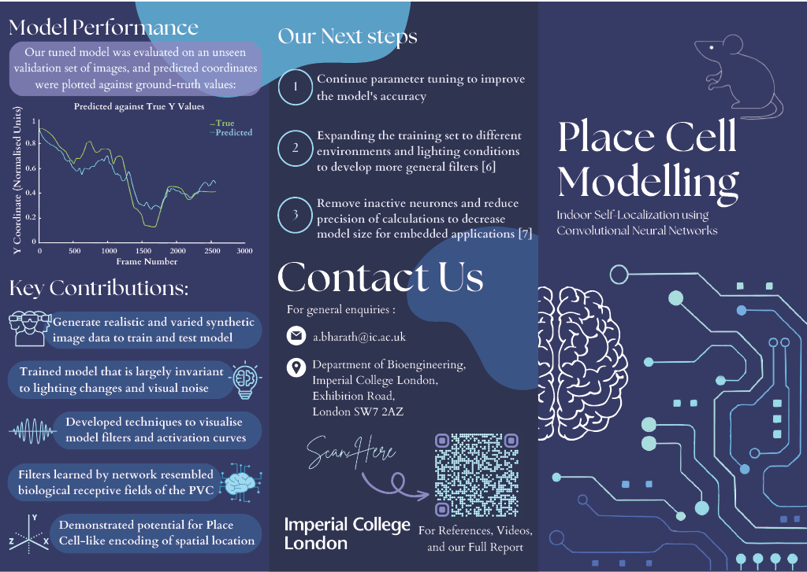
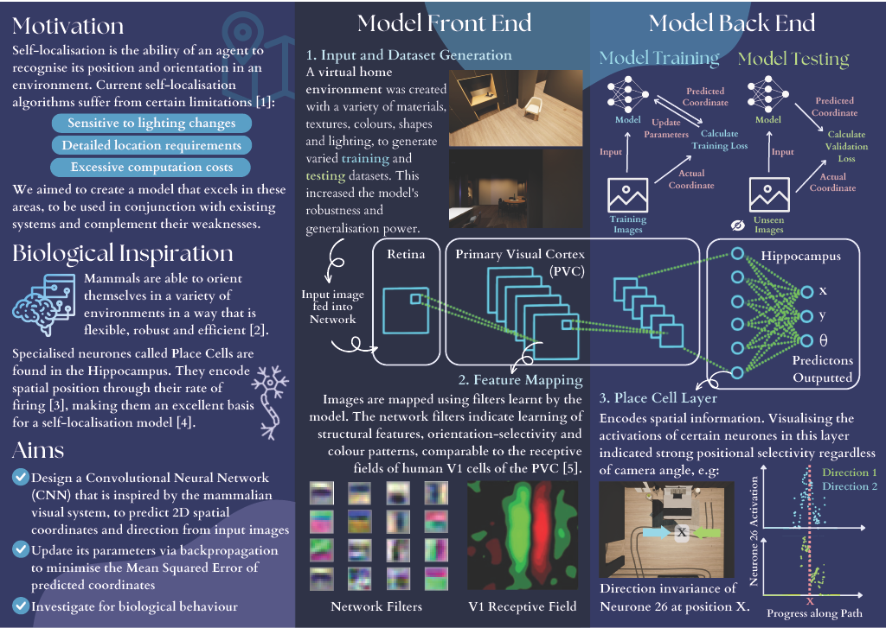

# Place Cell Inspired Deep Learning Network

This was my Bachelor Project in collaboration with Arinjay Mishra, Adam Song, Linca Chuk, Denise Wong and Keana Aitcheson. We benefitted from the excellent supervision of Prof. Anil Bharath from the Department of Bioengineering at Imperial College London. 

## In this repo:
- Notebooks containing the image data processing, training and evaluation workflows
- [Project report](Group1_Place_Cell_Modelling_Final_Report.pdf)
- [Brochure](Place_Cell_Modelling_Brochure.pdf)

## Project Motivation
The goal of the project was to leverage biological mechanisms to perform self-localisation in indoor environments. Self-localisation is the ability to calculate one's position, usually from egocentric data, e.g. POV camera frames or LIDAR readings. Traditional self-localisation and mapping (SLAM) techniques are sensitive with changes in the environment, such as lighting changes and can be computationally expensive. 

We sought inspiration from biological place cells, located in the hippocampus, which encode information related to spatial memory and navigation. This was achieved by implementing a Convolutional Neural Network where the convolutional kernels could be seen as analogues to biological receptive fields, and the following dense layers would correspond to higher level feature detectors in V1 and hippocampus. 

## Deliverables
Please checkout our report and brochure!

 </img>
 </img>
